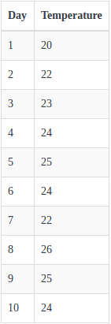
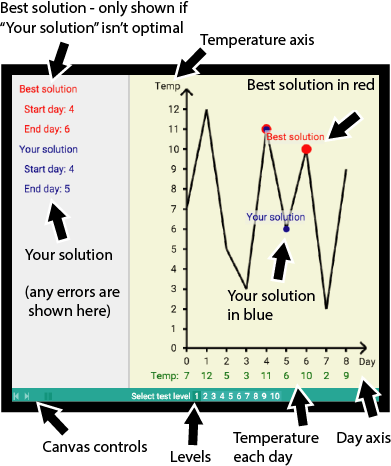

# longestSequnceOfSameTemperature
A solution of a test for finding a longest consecutive sequence of days where the temperature stays within five degrees

Longest sequence

Overview

Your task is to find the longest consecutive sequence of days where the temperature stays within five degrees. First, you will be presented with a description of the problem. Then, we will describe to you the API available to you in order to solve the problem. Following that will be an explanation of how scores are calculated.
Make sure to read the entire description before attempting the problem.
Task Description
Given a list with the mean temperature per day, find the longest consecutive sequence of days where the temperature stays within five degrees. In other words the maximum temperature within the sequence minus the minimum temperature within the sequence must not be greater than five. All mean temperatures have integer values.

Example:

 
In table above it can be seen that there are two date ranges where the temperature is within 5 degrees:
1.	Day 1 to day 7
2.	Day 2 to day 10
As the date range of day 2 to day 10 is larger, as a start day the value 1 would be returned and as an end day the value 10 would be returned. If there is more than one sequence which is the longest, you may return any of them.
Note that the optimal sequence may start and end on the same day. There will always be at least one day with a temperature in the input list.

Solution Example

API Description

The following data is available for you to access through the API provided. Details about the API functions and the data they provide can be found under the API tab.
1.	Number of days
 - The total number of days available to you for this level.
2.	Get temperature on day
 - The average temperature for that day.

